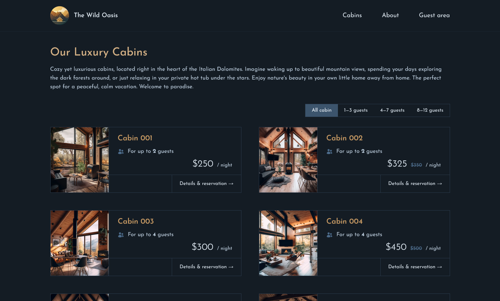

# The Wild Oasis

The Wild Oasis is a small boutique hotel with 8 luxury wooden cabins.
This customer-facing website is specifically designed for guests to use, allowing them to learn about the hotel, browse all cabins, reserve a cabin, and create and update their profiles. [Live](https://wild-oasis-guests.vercel.app/)

## Tech Stack

- **Framework**: Next.js
- **UI State Management**: Context API
- **Authentication & Authorization**: Auth.js & Supabase
- **Authentication Provider**: Google Cloud OAuth 2.0
- **DB/API**: Supabase
- **Styling**: TailwindCSS
- **Payment Gateway**: Stripe
- **Invoice**: Resend & React Email
- **Additional Libraries**: date-fns, react-day-picker, heroicons

## Pages

- **Homepage**: /
- **About Page**: /about
- **Cabin Overview**: /cabins
- **Cabin Detail**: /cabins/:cabinId
- **Signup**: /signup
- **Login**: /login
- **Reservation List**: /account/reservations
- **Edit Reservation**: /account/reservation/edit/:bookingId
- **Update Profile**: /account/profile
- **Checkout Page**: /checkout/:bookingId
- **Recover Forgotten Password**: /recovery/forgot-password
- **Recover Reset Password**: /recovery/reset-password?:sessionCode

## Features

### Authentication

- Only authorized users can log in and use the app.
- Users are authenticated via Supabase authentication and Google OAuth 2.0.
- Direct sign-ups and sign-ins using Supabase are supported, allowing users to register without Google.
- Supabase-signed-up users can change their password.
- Two-factor authentication through email verification.
- On sign-up, each guest receives a profile in the Supabase DB.

### Cabins

- Guests can browse all available cabins with details such as cabin photo, name, capacity, price, and current discounts.
- Guests can filter cabins by maximum guest capacity and check available dates.

### Reservations

- Guests can reserve a cabin for specific date ranges.
- Guests can view, update, or cancel their past and future reservations.
- **Stripe Integration**: A payment gateway is integrated using Stripe to allow secure online payments during the booking process.
- Guests receive a confirmation email and payment invoice upon successful booking.

### Profile

- Guests can create and update their profiles, storing personal details to make the check-in process faster.
- Guests can update personal information, change their password, and manage profile details.

### Notifications and Emails

- **Email Confirmation**: Guests receive a confirmation email upon successful booking.
- **Payment Invoice**: A detailed payment invoice is emailed to guests after confirming the booking through Stripe.

### Responsive Design

- The app is fully responsive and optimized for mobile, tablet, and desktop screens, ensuring a seamless user experience across devices.

## Improvements

- ~~Currently, the website accepts no online payments. This can be improved by adding a payment gateway like Stripe or Razorpay for online payments.~~ [✅ Feature Added]
- ~~Add responsiveness to the web app. Currently, the app is only optimized for large screens (i.e., desktop).~~ [✅ Feature Added]
- ~~Accept direct sign-ups and sign-ins using Supabase authentication rather than just Google sign-up.~~ [✅ Feature Added]
- ~~Allow Supabase signed up users to change password.~~ [✅ Feature Added]
- ~~Send a confirmation email and payment invoice to the user on successful booking of a cabin.~~ [✅ Feature Added]
